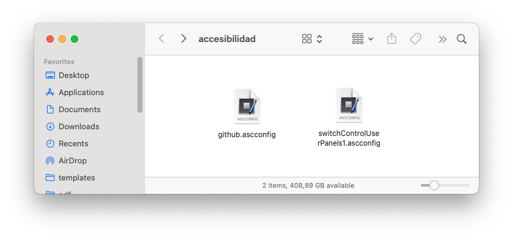
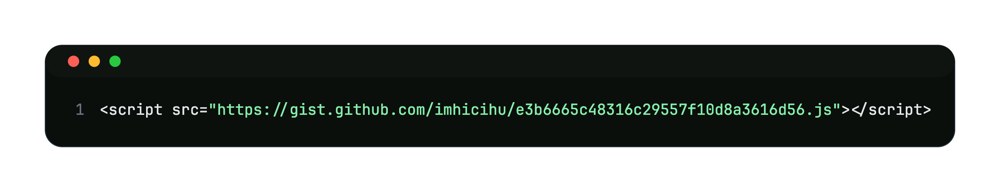

  

---

# RATIONALE / [MOTIVACION](LEEME.md)
* Efforts to reach accesibility for every human being
* This repo is a living document that will grow and adapt over time according [law](https://www.argentina.gob.ar/justicia/derechofacil/leysimple/accesibilidad-paginas-internet), health issues and internal projects, etc.

---

### Accessibility Keyboard

* [Download](panels/imhicihu-keyboard-access.zip) and unzip to get this panel

* Then go to `System Settings` > `Accessibility` > `Keyboard` > `Panel Editor`
* Once in `Panel Editor` go to `File` > `Open` > select the unzipped file
* Then go to `System Settings` > `Accessibility` > `Keyboard` > `Panel Editor` > Enable `Accessibility Keyboard`
  

---

### Accessibility Panel

* [Download](panels/IMHICIHU_Panel_accesibilidad.zip) and unzip to get this panel

* Then go to `System Settings` > `Accessibility` > `Keyboard` > `Switch Control` > `Panel Editor`
* Once in `Panel Editor` go to `File` > `Open` > select the unzipped file
* Then go to `System Settings` > `Accessibility` > `Keyboard` > `Switch Control` > Enable `Switch Control`
  

### Voice control

### Code of Conduct

* Please, check our [Code of Conduct](code_of_conduct.md)

### Legal ###

* All trademarks are the property of their respective owners

### Licence ###

* The content of this project itself is licensed under the 
  
---
> [!NOTE]
> This accesibility tools works only in the MacOSX environment

