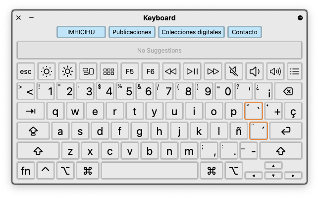
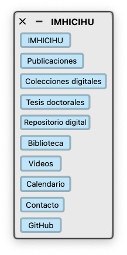

  

---

# Accesibilidad

Efforts to reach accesibility for every human being

### Accesibility Keyboard

* [Download](panels/imhicihu-keyboard-access.zip) and unzip to get this panel

  
  
* Then go to `System Settings` > `Accesibility` > `Keyboard` > `Panel Editor`
* Once in Panel Editor go to `File` > `Open` > select the unzipped file
* Then go to `System Settings` > `Accesibility` > `Keyboard` > `Panel Editor` > Enable `Accesibility Keyboard`

### Panel

* [Download](panels/IMHICIHU_Panel_accesibilidad.zip) and unzip to get this panel

  
  
* Then go to `System Settings` > `Accesibility` > `Keyboard` > `Switch Control` > `Panel Editor`
* Once in `Panel Editor` go to `File` > `Open` > select the unzipped file
* Then go to `System Settings` > `Accesibility` > `Keyboard` > Switch Control` > Enable `Switch Control`

> [!NOTE]
> This accesibility tools works only in the MacOSX environment

